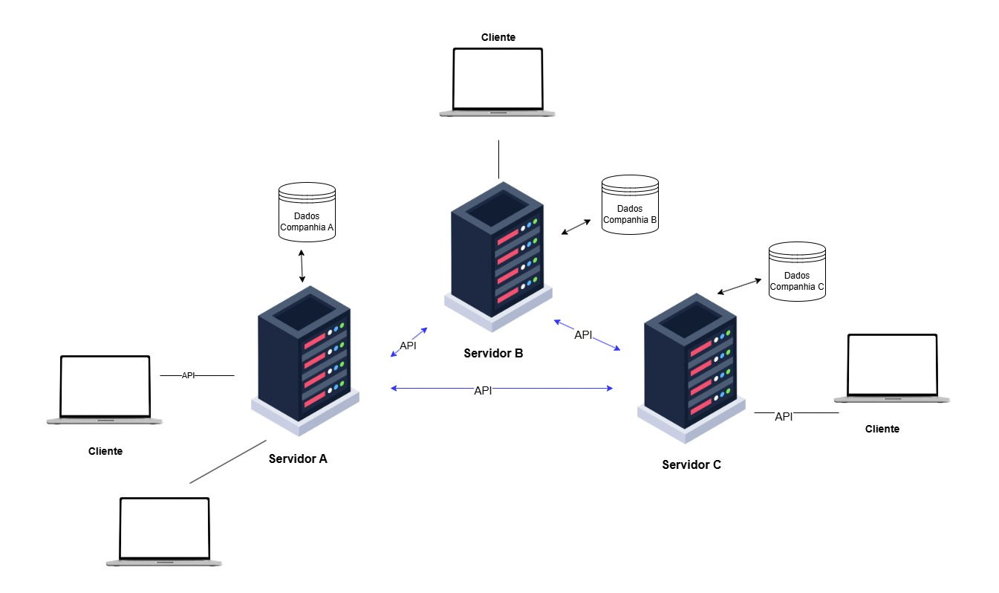

<h1 align="center"><i>Voe Bem</i></h1>

 Sistema de Venda Compartilhada de Passagens Aéreas.

## Introdução

A crescente demanda por viagens aéreas impulsionou uma revolução na indústria da aviação. O que antes era um setor restrito a um público seleto, hoje se tornou um dos principais meios de transporte, democratizando o acesso a diversas partes do mundo e impulsionando o desenvolvimento econômico

Com o aumento exponencial do número de passageiros, as companhias aéreas de baixo custo emergiram como protagonistas desse cenário, oferecendo tarifas mais competitivas e rotas para destinos antes considerados inacessiveis. No entanto, a complexidade da gestão de um sistema de vendas de passagens aéreas, especialmente para essas empresas com operações mais enxutas, exige soluções tecnológicas eficientes e escaláveis.

Neste contexto, o desenvolvimento de um sistema distribuído de venda de passagens aéreas surge como uma resposta às necessidades do mercado. Ao distribuir as funcionalidades do sistema em diversos servidores, é possível garantir maior disponibilidade, escalabilidade e desempenho, características essenciais para lidar com o volume de transações e a alta concorrência do setor.

Pensando nisso, foi proposto aos alunos do curso de Engenharia de Computação da Universidade Estadual de Feira de Santana (UEFS) o desenvolvimento de um sistema distribuido para venda de passagens aéreas. Este relatório visa descrever objetivamente o desenvolvimento de tal solução em que os clientes, através da internet, podem comprar passagens com várias conexões, podendo cada trecho pertencer a companhia diferentes. Para tal, a Voe Bem possui uma arquitetura descentralizada em que cada companhia mantém seu próprio servidor e banco de dados local, sendo a comunicação entre os servidores realizada através de APIs REST. Diante dos requisitos e funcionalidades do sistema, soluções para transações que afetam recursos distrubídos, como *Three Phase Commit (3PC)*, e de consenso foram utilizados para garantir eficiência e confiabilidade na reserva de passagens. Ao final do desenvolvimento, a aplicação foi virtualizada por meio de contêineres Docker.

## Sobre o Sistema

Para solucionar o problema proposto, algoritmos de transação distribuída, consenso e a arquitetura da API REST foram analisados e adotados. A linguagem de programação Pyhton foi escolhida para implementação juntamente com o framework Flask e a bibloteca React no frontend.

Além disso, o sistema é composto por rotas de tráfego aéreo nas principais cidades da Bahia e as siglas dos aeroportos utilizadas na busca de rotas é apresentada na lista abaixo. 

Legenda AEROPORTOS
- (SSA) Salvador - Aeroporto Deputado Luís Eduardo Magalhães
- (IOS) Ilhéus - Aeroporto de Ilhéus - Jorge Amado
- (BPS) Porto Seguro - Aeroporto de Porto Seguro
- (LEC) Lençóis - Aeroporto Horácio de Mattos
- (PAV) Paulo Afonso- Aeroporto de Paulo Afonso
- (BRA) Barreiras - Aeroporto de Barreiras
- (FEC) Feira de Santana - Aeroporto João Durval Carneiro
- (VAL) Valença - Aeroporto de Valença
- (GNM) Guanambi - Aeroporto de Guanambi
- (TXF) Teixeira de Freitas - Aeroporto de Teixeira de Freitas
- (VDC) Vitória da Conquista - Aeroporto Glauber de Andrade Rocha

### Arquitetura da Solução

O modelo *peer to peer* (P2P), no qual o sistema se baseia, permite que cada nó funcione como cliente e servidor ao mesmo tempo, facilitando o compartilhamento de recursos e serviços (Almeida e Costa, 2007). Essa arquitetura  promove a autonomia de cada nó, distribui o armazenamento de forma descentralizada e elimina a dependência de um único ponto, resultando em uma alta disponibilidade de dados e serviços (Santos e Amaral, 2006).

Cada companhia do sistema corresponde a um servidor com seu conjunto de dados independentes, dentre eles as rotas ofertadas pela empresa e os usuários e pedidos na plataforma. 
A partir das interações com o usuário, o dispositivo atuando como cliente processa as entradas e gera requisições de dados ou serviços ao servidor. Dessa maneira, cada solicitação será processada no lado do servidor de uma companhia que, com acesso aos dados de voos, assentos, clientes e pedidos, enviará a resposta a ser exibida no lado do cliente. Alguns serviços, como a obtenção de rotas disponíveis, demandam dados de voos distribuídos no servidor de cada companhia. Assim, requisições são disparadas para os demais nós do sistema, processadas e formatadas para o retorno ao cliente.   

Para facilitar a comunicação entre os nós, o sistema utiliza APIs REST, uma interface padronizada que permite que os nós P2P troquem informações e solicitem recursos de forma eficiente e escalável. A arquitetura REST, amplamente adotada para sistemas distribuídos, permite que os nós se comuniquem de maneira independente da plataforma e da linguagem de programação, utilizando protocolos HTTP para envio de requisições. Os componentes e conexões desta arquitetura são explicitados na Figura 1.

  <figure>  
     
    <figcaption>
      
 

**Figura 1** - Componentes e conexões na arquitetura do sistema
    </figcaption>
  </figure>

### Protocolo de Comunicação

A comunicação via API REST possui endpoints para o métodos remotos do sistema. As especificações da API são expostas na Tabela 1.

| Método   |  Endpoint  | Parâmetros |  Response | Descrição |
---------- |-----------|-------------|---------- |-----------|
|  POST    |   /login     |   user_id: str, senha: str | 
 
200
 status: login bem-sucedido
 
 
400
 status: ID ou senha não preenchidos
 

401
 status: ID ou senha incorretos
  | endpoint para autenticação do usuário e acesso ao sistema
|  GET     |   /grafo_rotas     | None    | 
 
200
 status: sucesso 
 | Endpoint utilizado para acessar o grafo de rotas de uma companhia 
|  POST    |   /buscar_rotas     | origem: str, destino: str    | 
 
200
 status: sucesso
 
 
400
 status: Origem ou destino não preenchidos

 
500
 status: Erro interno na busca
  | endpoint para buscar todas as rotas possíveis da origem até o destino dados.
|  GET     |   /supergrafo     | None    | 
 
200
 status: sucesso 
 
 
500
 status: erro interno ao construir o supergrafo 
 | endpoint para construção e acesso ao grafo de rotas de todas as companhias criado a partir das rotas locais em cada servidor
|  POST    |   /prepare      |  reserva_id: str, trechos: dict  |

200
 status: sucesso
 
 
409
 status: erro de conflito no status de um recurso
| Endpoint que verifica a disponibilidade dos trechos para iniciar uma transação distribuida 
|  POST    |   /pre-commit      |  reserva_id: str  |  
 
200
 status: sucesso
 
 
409
 status: erro de conflito no status de um recurso
      | Endpoint para confirmação preliminar do servidor 
|  POST    |   /do_commit      |  reserva_id: str, user_id: str  |   
 
200
 status: sucesso
 
 
409
 status: erro de conflito no status de um recurso
  | Endpoint utilizado pelo coordenador para autorizar a execução da transação
|  POST    |   /abort      |  reserva_id: str | 
 
200
 status: sucesso
 | Endpoint usado em qualquer ponto da transação distribuída para desfazer alterações temporárias 
|  POST    |   /comprar_passagem      |  user_id: str, trechos: dict  |  
 
200
 status: sucesso
 
 
500
 status: erro interno na transação
 
500
 status: 
    | Endpoint para comprar uma passagem usando o protocolo de transação distribuída Three Phase Commit
|  POST    |   /sincronizar_reserva     |  user_id: str, reserva: dict  |  
 
200
 status: Reserva sincronizada com sucesso
 
 
400
 status: Dados de sincronização incompletos
  | Endpoint para sincronizar a reserva realizada em cada servidor 
|  GET    |   /pedidos/<user_id>      | user_id: str    |  
 
200
 status: sucesso
 
 
404
 status: Usuário não encontrado
     | Endpoint para obter os pedidos de um usuário específico

Tabela 1: Endpoints da API

### Roteamento

Para possibilitar a busca e venda de rotas que combinam trechos de várias companhias aéreas, foi adotado um algoritmo inspirado no protocolo de roteamento de estado de enlace, também conhecido como  *Link State Routing*. Este protocolo é amplamente utilizado em redes para oferecer uma visão global da topologia, o que permite uma determinação eficiente e precisa das rotas (Tanenbaum & Wetherall, 2011). 

Assim sendo, cada nó ou servidor do sistema Voe Bem armazena temporariamente uma cópia completa da topologia da rede com o supergrafo de todos os voos das companhias. A cada operação de busca em um servidor, os grafos locais de cada nó são consultados e agrupados em uma única estrutura contendo todos os caminhos possíveis no sistema. Dessa maneira, ao buscar uma rota de uma origem A até um destino X, trajetos como A-B-C-X, A-B-D-E-X, A-X, A-C-X e todas as possíbilidades dentre as companhias da plataforma são entregues ao usuário.  

Portanto, através da execução do algoritmo, o sistema mantém uma visão unificada e atualizada das rotas disponíveis, assegurando que os usuários consultem sempre as informações mais recentes.

### Concorrência Distribuída
Para a realização da compra de passegem na arquitetura distribuída o *Three-Phase Commit Protocol* (3PC), ou protocolo de três fases, foi utilizado. Este método de coordenação de transações distribuídas visa garantir a consistência dos dados em sistemas distribuídos, uma vez que uma transação distribuída só ocorre quando todos os participantes confirmam as alterações e é cancelada caso algum dos nós não confirme ou apresente falhas. Também, as operações distribídas incluiram *locks* para garantir a consistência e controle de concorrência no sistema multithread implementado.

No protocolo 3PC, a operação é dividida em três fases: Prepare (Preparação), Pre-Commit (Pré-Comprometimento) e Do Commit (Execução do Commit) como é ilustrado na Figura 2. Em qualquer uma das etapas, uma resposta negativativa prejudicial à transação dispara o cancelamento ou abort em todos os servidores, que retornam ao último estado antes da operação de compra iniciada. 

1. Fase de Preparação
Na fase de preparação ou votação, o coordenador inicia a transação distribuída e consulta cada nó participante, solicitando se estão prontos para realizar o commit. Cada nó verifica a disponibilidade do recurso para a transação solicitada e se consegue concluir a operação de forma consistente, respondendo com "commit" (caso esteja pronto) ou "abort" (caso contrário). Se todos os nós responderem com "commit", a transação prossegue para a próxima fase. Caso algum nó vote "abort", a transação é cancelada, e o coordenador informa a todos os nós para manterem o estado anterior (Tanenbaum & Van Steen, 2016).

2. Fase Pre-Commit
Se todos os participantes responderam positivamente ("sim" ou "commit"), o coordenador envia um comando de pré-comprometimento (pre-commit) a cada nó, solicitando que se preparem para o commit. Nesta fase, os nós registram um ponto de recuperação para garantir que poderão finalizar a transação, mesmo se ocorrer uma falha temporária do coordenador.
Esse passo adicional é o diferencial do 3PC, pois garante que os participantes estejam prontos para completar ou abortar a transação caso o coordenador fique inacessível. Isso reduz a probabilidade de deadlock ou inconsistência de estado entre os nós (Gray & Reuter, 1993; Coulouris et al., 2013).

3. Fase Do Commit (Decisão)
Na última fase, o coordenador emite o comando de commit definitivo a todos os nós. Se o coordenador falhar antes de enviar esse comando, os participantes podem se comunicar diretamente e, com base na fase de pre-commit, decidir prosseguir ou abortar a operação.
Esse mecanismo de recuperação torna o 3PC mais robusto que o 2PC, já que o estado de pre-commit evita que os nós fiquem indefinidamente bloqueados (Bernstein & Newcomer, 2009).
Nesta última etapa, o sistema Voe Bem também implementa o consenso da passagem comprada por um usuário para que os servidores de cada companhia possuam dados atualizados em tempo real após uma compra.

No sistema desenvolvido, o coordenador corresponde ao servidor no qual o cliente se conectou e requisitou o serviço. Além disso, na etapa *do commit* a reserva bem sucedida é replicada para todos os nós com o itnuito de garantir o consenso de informações dos usuários entre todos os nós.
Por meio de logs e do armazenamento de reservas pendentes, a plataforma permite uma maior resiliência a falhas do coordenador e reduz o risco de deadlocks entre os nós. Dessa maneira, o protocolo 3PC atende aos requisitos do sistema de maneira eficiênte e robusta.

  <figure>  
    
    <figcaption>
      
 

**Figura 2** - Fluxo de fases no Three Phase Commit
    </figcaption>
  </figure>

### Confiabilidade da Solução
O sistema possui rotinas de tolerância a falhas para que a transação não seja prejudicada por uma falha no coordenador ou dos participantes. No protocolo *Three Phase Commit* implementado, a fase intermediária *pre-commit* garante que todos os nós tenham registros e estejam preparados para seguir para o próximo estágio mesmo em caso de falha na conexão do coordenador. A falha temporária do coordenador não compromete a compra de passagens, pois os estados dos participantes registrados são recuperados e a transação concluída. Desse modo, cada participante é capaz de realizar o commit e finalizar a transação com maior independência. 

Os pontos de recuperação são fundamentais para que, caso os servidores apresentem exceções durante etapas críticas, como a fase de votação ou execução do commit, a transação seja cancelada e a confiabilidade e consistência do sistema mantidos.

Também, após cada operação de compra, o banco de usuários de todas as companhias é atualizado via API garantindo o consenso de dados entre os servidores.

### Docker
O sistema Voe Bem implementa uma API REST utilizando o framework Flask na versão 3.0.3, Python 3.12 e o Gunicorn server para otimizar a execução multithread, além da bibloteca React para o desenvolvimento da interface gráfica para o cusuário.

O uso da plataforma Docker otimiza a execução do sistema ao dispensar a configuração de cada máquina física. Através de um container para o cliente e um container servidor para cada companhia, a aplicação pode ser executa em diferentes máquinas com a plataforma Docker. 

## Referências

Almeida, R. & Costa, F. (2007). Arquitetura Peer-to-Peer para Computação Distribuída: Desafios e Oportunidades. Anais do Simpósio Brasileiro de Redes de Computadores, 35(1), 142-155.

Bernstein, P. A., & Newcomer, E. (2009). Principles of Transaction Processing. Morgan Kaufmann.

Coulouris, G., Dollimore, J., Kindberg, T., & Blair, G. (2013). Distributed Systems: Concepts and Design. Addison-Wesley.

Gray, J., & Reuter, A. (1993). Transaction Processing: Concepts and Techniques. Morgan Kaufmann.

Tanenbaum, A. S., & Van Steen, M. (2016). Distributed Systems: Principles and Paradigms. Prentice Hall.

Tanenbaum, A. S., & Wetherall, D. (2011). Computer Networks. Pearson.